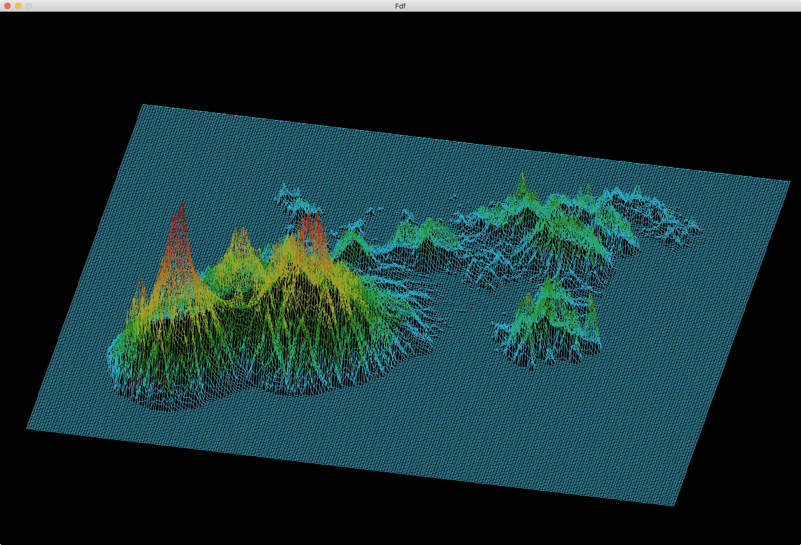
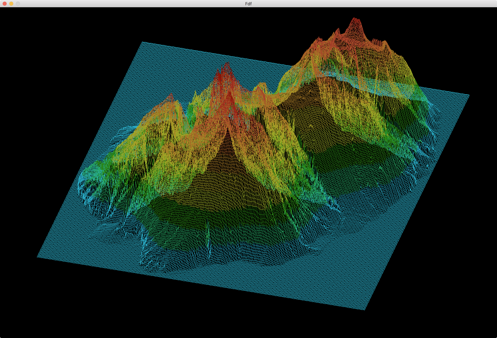
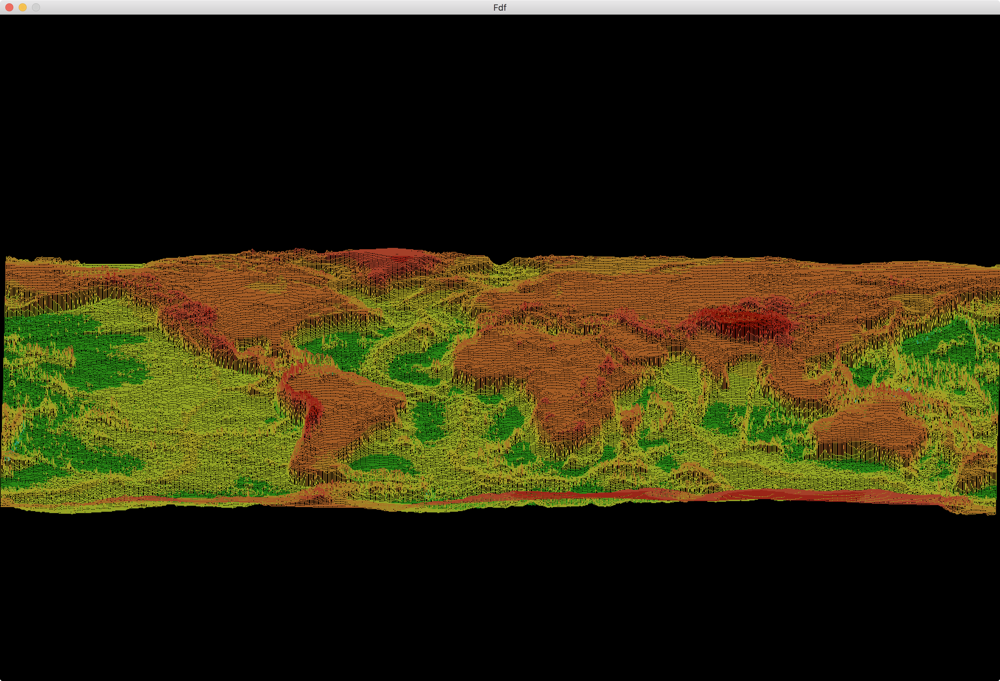

# Fdf

<h1>Projet "Fdf" réalisé à l'école 42</h1>
Il s'agit d'un projet graphique, dont le but est d'afficher une carte en relief entrée par l'utilisateur. La carte correspond à un fichier texte, avec des points disposés de la sorte :
<ul>
	<li>Leur numéro de colonne correspond à leur position sur l'axe x</li>
	<li>Leur numéro de ligne correspond à leur position sur l'axe y</li>
	<li>Leur valeur correspond à leur position sur l'axe z (Altitude)</li>
</ul>
Ainsi, le programme lit ces données et ouvre la carte dans une fenêtre graphique à l'aide de la minilibx.
<h2>Voici la carte de la martinique :</h2>

<h2>Voici la carte de la réunion :</h2>

<h2>Voici la carte du monde :</h2>

<h1>Contenu du dossier</h1>
Le dossier contient un Makefile ainsi que tous les fichiers nécessaires à la compilation du programme. Il contient aussi un dossier maps dans leque se situent des cartes que vous pourrez ouvrir.
<h1>Utilisation</h1>
Après avoir téléchargé le dossier, rendez-vous à la racine de celui ci. Lancez la commande <b>make</b> dans votre terminal. Le programme se compile, il a pour nom "fdf".
Exécutez-le avec en paramètre le fichier que vous souhaitez, par exemple comme ceci : 
<b>./fdf maps/martinique.fdf</b>
<h1>Commandes d'utilisation :</h1>
Appuyez sur la flèche du haut ou la flèche du bas pour faire varier la hauteur de l'élément. Les flèches de droite et de gauche permettent de le faire tourner sur lui-même.
Les touches <b>i</b> et <b>o</b> permettent de respectivement zoomer et dézoomer.
Enfin, les commandes <b>z</b>, <b>q</b>, <b>s</b> et <b>d</b> permettent de se déplacer dans la carte.
<h1>Commandes d'utilisation :</h1>
Appuyez sur la flèche du haut ou la flèche du bas pour faire varier la hauteur de l'élément. Les flèches de droite et de gauche permettent de le faire tourner sur lui-même.
Les touches <b>i</b> et <b>o</b> permettent de respectivement zoomer et dézoomer.
Enfin, les commandes <b>z</b>, <b>q</b>, <b>s</b> et <b>d</b> permettent de se déplacer dans la carte.
